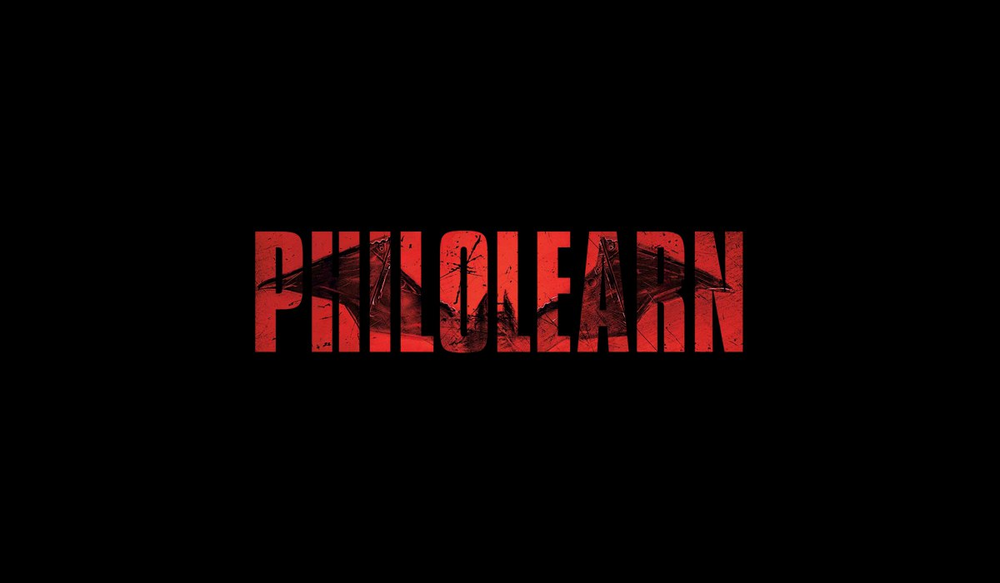

# BatName Bot

This is a robot for creating texts in the form of the Batman 2020 logo




To run this program, you must first create the ‍‍`.env` file in src and copy your token in it.

```
TOKEN = 'your-token'
```

Here you are one step away from starting the robot
Just install the program dependencies completely. All the important dependencies of the program are in the requirements.txt file and you can install all the dependencies together with the following command.

```
$ pip install -r requirements.txt
```

You can now go to the `src` folder and run the bot by running the following command.

```
$ python main.python
```
</br>

>My suggestion is to create a virtual environment first before halving the dependencies and then step in to install the dependencies.

